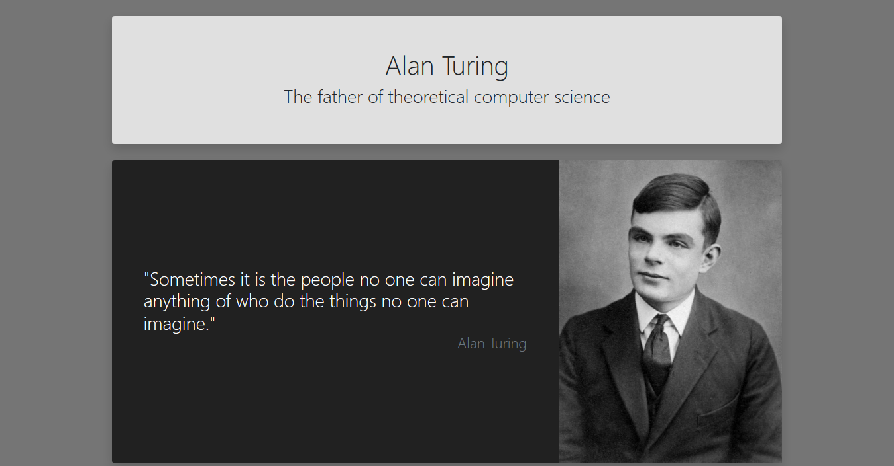

# Alan Turing tribute page – web site
## Description
> Tribute page dedicated to Alan Turing, considered as the father of theoretical computer science and whose work lay the foundation to the theoretical machine that later came to be known as the computer.
## Technologies used:
* HTML
* CSS
* Bootstrap
## Screenshot
